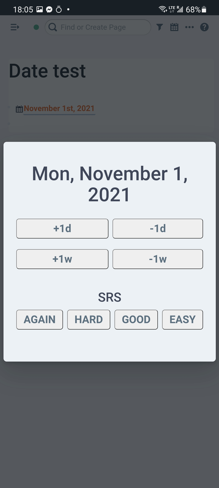

# Roam Date UX enhancements

---

The development is supported by <a href="https://roam.garden/"> </a> - a service that allows you to publish your Roam notes as a beautiful static website (digital garden)

---

This plugin adds a few enhancements to the experience of interacting with dates in Roam.

## Features

### Date control widget (including SRS support)

SRS behaviour is compatible with [Roam Toolkit](https://github.com/roam-unofficial/roam-toolkit)

The extension will add the calendar icon close to each date link. Clicking on the icon will invoke the widget & allow you to edit the selected date



### Navigation Shortcuts

- <code> Ctrl + Shift + `</code> - go to today's page
- <code> Ctrl + Shift + 1</code> - open today's page in the right sidebar

### Date Manipulation

You can create dates using [**natural language**](https://github.com/wanasit/chrono):


Replace mode:


## Installation

This should be available in Roam Depot now, but if you want to install it manually, you can do so by following these steps:

1. [Install Roam plugin](https://roamstack.com/how-install-roam-plugin/) via the following code-block

```javascript
/** roam-date-widget - date manipulation widget
 *  Author: Vlad Sitalo
 *  Docs: https://github.com/Stvad/roam-date
 */


const roamDateId = "roam-date-script"
const oldRoamDate = document.getElementById(roamDateId)
if (oldRoamDate) oldRoamDate.remove()
var roamDate = document.createElement('script')
roamDate.type = "text/javascript"
roamDate.id = roamDateId
roamDate.src = "https://roam-date.roam.garden/main.js"
roamDate.async = true
document.getElementsByTagName('head')[0].appendChild(roamDate)
```

## Known issues

- Currently date widget, works only for blocks with 1 date in them
